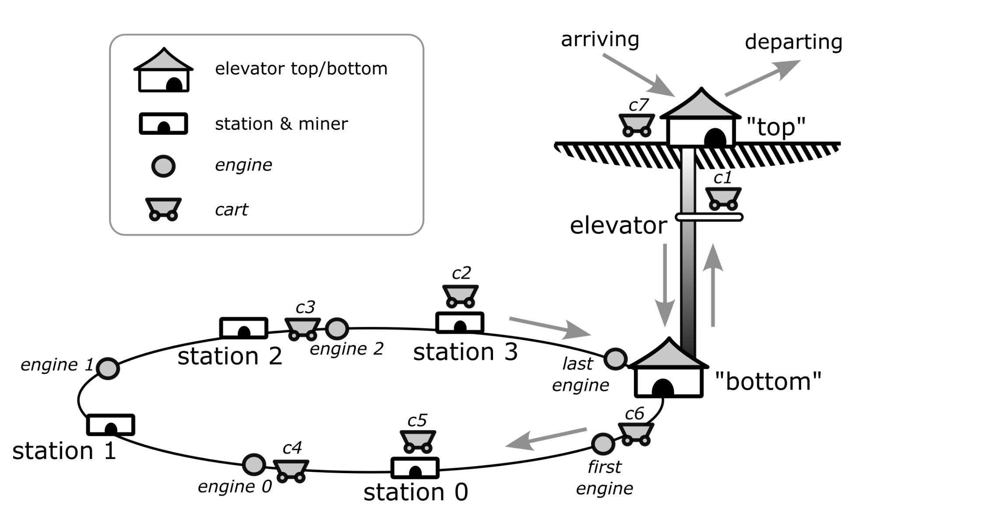

# SWEN90004-Assignment1
University of Melbourne, SWEN90004 Assignment 1a &amp; 1b code.

# Assignment 1a: Mines of Semaphoria

## Introduction 
The Mines of Semaphoria are hidden deep within the Crypto Mountains, where miners scour the rock for gems. The Mines of Semaphoria are accessed via a single elevator from the surface. From the bottom of the elevator, a number of stations are connected by a ring-shaped underground track, as shown in the figure below.

There is a miner at each station who mines for gems. Gems are deposited at the station, to be loaded onto carts used to carry the gems out of the Mines of Semaphoria. Each station can only hold a single gem at a time. If a station already holds a gem, no further gems will be mined until the current gem has been loaded onto a cart.

Carts operate as follows: A cart arrives at the top of the elevator, which carries it down below the ground. The elevator can only carry a single cart at a time. From the bottom of the elevator, a cart is carried to each station in turn by a series of engines.

Each engine moves backwards and forwards between a pair of stations, or between a station and the bottom of the elevator (eg, the first engine move backwards and forwards between the bottom of the elevator and station 0). Each engine can only carry a single cart at a time.

Each station can only be occupied by a single cart at a time. While a cart can be carried toward a station already occupied by another cart, it cannot be delivered to the station until that cart has been collected by the next engine.

At each station, a cart is loaded with a single gem. If there is no gem available at a station, the cart waits until another has been mined by the miner, at which point the gem will be loaded and the cart can be collected by the next engine. Each cart can carry as many gems as there are stations (ie, one gem from each station).

Once a cart has completed a full circuit of the underground track, the last engine carries it back to the bottom of the elevator, which carries it up to the surface to then depart from the Mines of Semaphoria.

Figure: A schematic diagram of the Mines of Semaphoria. The diagram shows: 1. The elevator, which carries carts between the surface and underground. 2. The ring-shaped track that connects the bottom of the elevator to the individual stations. 3. The engines which shuttle backwards and forwards between stations (and the bottom of the elevator) to carry carts to each of the mine stations. 4. The carts which arrive at the mine complex, descend via the elevator, are carried by engines to each station, where they are loaded with gems, and then ascend via the elevator to depart the mine complex. This state of the system shown in this figure corresponds to the end of the trace of events below.

## Assumptions
You should make the following additional assumptions about the behaviour of the Mines of Semaphoria system:

- The elevator will ascend whenever it is at the bottom and there is a cart waiting at the bottom to ascend.
- The elevator will descend whenever it is at the top and there is a cart waiting at the top to descend.
- At random intervals, an elevator operator will send the elevator up or down when it is empty (ie, not carrying a cart).
- Each cart travels around the underground track in the same direction (ie, from the bottom of the elevator to station 0, then to station 1, then to station 2, etc.)

## Tasks
Your first task is to implement a simulation of the Mine system described above. It should be suitably parameterised such that the timing assumptions can be varied, and the number of stations can be varied. You should use your simulator to explore the behaviour of the system to identify any potential problems with its operation.

Note: If you implement the system as described above, you are likely to observe that it does not behave perfectly. This is intended, and you are not required to fix any observed problems as part of this assignment. You are encouraged to identify these problems and think about how they could be fixed – you will do this as part of the next assignment.

The simulation should produce a trace of events matching the (partial) trace below, generated after the system has been running for some time. As the behaviour of the simulation will be non-deterministic, the output from your code won’t match this example exactly, but the format of the trace messages should match. "cart [2: 1]" indicates the cart with id number 2, currently carrying one gem (ie, it has visited and single station so far on its journey).

At the end of the trace, the state of the system corresponds to the figure above.

```
:
cart [5: 0] arrives at the mines
cart [2: 1] loaded with a gem
cart [2: 1] collected from station 0
cart [3: 0] delivered to station 0
cart [4: 0] collected from elevator
elevator ascends (empty)
elevator descends with cart [5: 0]
cart [6: 0] arrives at the mine
cart [1: 2] delivered to station 2
cart [1: 3] loaded with a gem
cart [1: 3] collected from station 2
cart [2: 1] delivered to station 1
cart [2: 2] loaded with a gem
cart [2: 2] collected from station 1
cart [1: 3] delivered to station 3
cart [1: 4] loaded with a gem
cart [1: 4] collected from station 3
cart [3: 1] loaded with a gem
cart [3: 1] collected from station 0
cart [4: 0] delivered to station 0
cart [5: 0] collected from elevator
elevator ascends (empty)
elevator descends with cart [6: 0]
cart [2: 2] delivered to station 2
cart [2: 3] loaded with a gem
cart [2: 3] collected from station 2
cart [7: 0] arrives at the mines
cart [3: 1] delivered to station 1
cart [3: 2] loaded with a gem
cart [3: 2] collected from station 1
cart [2: 3] delivered to station 3
cart [3: 2] delivered to station 2
cart [3: 3] loaded with a gem
cart [3: 3] collected from station 2
cart [4: 1] loaded with a gem
cart [4: 1] collected from station 0
cart [5: 0] delivered to station 0
cart [6: 0] collected from elevator
cart [1: 4] delivered to elevator
elevator ascends with cart [1: 4]
    :
```

A possible design and suggested components
The various locations (ie, the elevator and stations) can be treated as monitors while the active components of the system - miners, engines, and the elevator operator - can be treated as  processes.

Scaffold code Download Scaffold codeis provided to get you started. The following classes are provided:

Producer: Creates new carts that will arrive at the Mines to collect treasure, and hands them to the elevator, subject to the constraint that it is unoccupied and located at the top of the shaft. The times between arrival of new carts varies randomly.

Consumer: Removes carts from the Mines once they have visited all the stations, once they are back at the top of the elevator. The time between the departure of carts varies randomly.

Cart: Carts can be generated as instances of this class.

Params: A class which, for convenience, gathers various system-wide parameters, including timing assumptions.

Main: The overall driver of the simulation. Note that this won’t compile until you have defined some additional classes.

Apart from Params.java (where you will want to modify the parameter values) you should not need to make modifications to the scaffold code.

# Assignment 1b
## Introduction
There are two related parts to Assignment 1, which is worth 25% of your final mark. The first part, 1a, was worth 12.5% of your final mark; this part, 1b, is worth 12.5%.

In the first part (which you should complete before attempting this part) you designed and implemented (in Java) a concurrent simulation of the fictional Mines of Semaphoria. Now your task is to model that system using FSP, to use LTSA to check your model, and to identify and mitigate any problems that you discover through modelling. You should refer back to Assignment 1a for a description of the scenario.

## Tasks
### Task 1: Model
The first task is to model your implementation from Assignment 1a in FSP. That is, reverse engineer an FSP model from your Java implementation. Your model should contain comments that explain the design and its components. NB: If your implementation in Assignment 1a was incomplete, or too incorrect to form the basis of an FSP model, you may wish to construct your model based on the system description in the Assignment 1a specification.

I will release a sample solution for Assignment 1a after all submissions have been received (noting extensions) on 5 April 2025.

Note that there is no scaffold code for Assignment 1b, as there was for 1a, but many of the lecture examples will provide a useful guide to help get you started.

### Task 2: Check
Specify what you believe are the relevant safety and liveness properties for your FSP model. Note: for liveness, it may be the case that only a small number of properties are required. Use LTSA to check these properties.

### Task 3. Modify
You will most likely have discovered, either while completing Assignment 1a, or while completing Tasks 1 and 2 of this Assignment, that there is a potential issue with the operation of the system.

Propose at least one modification to the design of the system that mitigates this problem and update your FSP model. If you wish, you may also implement this modification in your original Java implementation of the system, and satisfy yourself that it now behaves “correctly” (ie, does not violate safety or liveness properties). You do not need to re-submit your Java code!

Be sure to create a copy of the file containing your original FSP model. You are required to submit both the original model from Task 1, and the modified model from Task 3 as separate files.